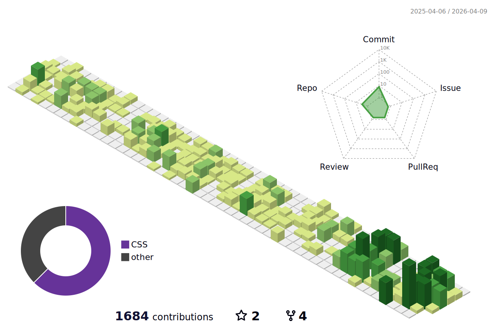

  

<h1>
:dromedary_camel: 낙타의 코딩 생존기!
</h1>

:punch: Spring, NestJS, React, 자료구조 그리고 pintOS를 비롯한 전반적인 CS 지식을 공부중입니다!

<!--
**jun9898/jun9898** is a ✨ _special_ ✨ repository because its `README.md` (this file) appears on your GitHub profile.

Here are some ideas to get you started:

- 🔭 I’m currently working on ...
- 🌱 I’m currently learning ...
- 👯 I’m looking to collaborate on ...
- 🤔 I’m looking for help with ...
- 💬 Ask me about ...
- 📫 How to reach me: ...
- 😄 Pronouns: ...
- ⚡ Fun fact: ...
-->

